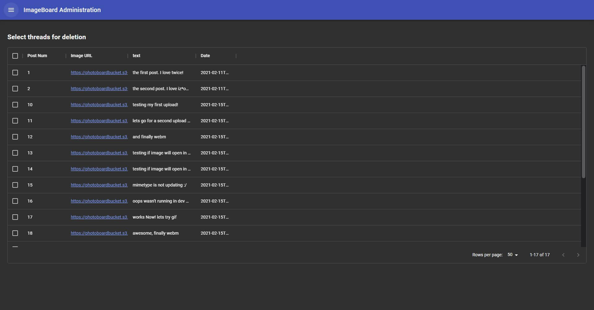
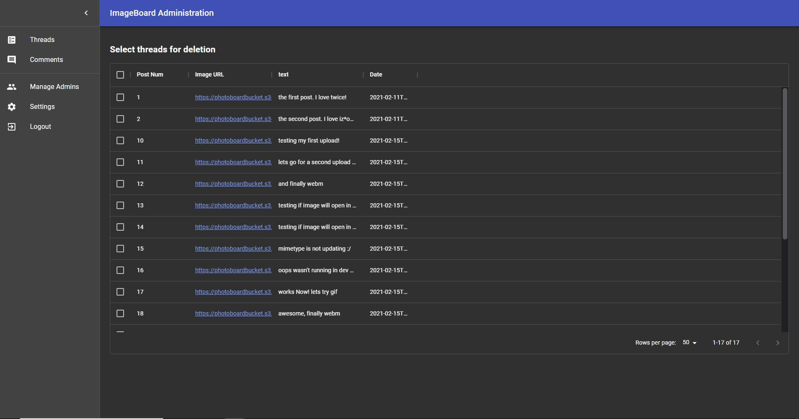

# ImageBoard Admin

Content management app for ImageBoard. Lets admins manage content on ImageBoard, i.e delete comments or threads they deem inappropiate. As well as giving them the ability to add and remove admins if they have the permissions to do so through a UI.

It shares the same backend as ImageBoard: https://github.com/AlisonWonderland/ImageBoard/tree/master

**Due to EC2/Beanstalk and ElastiCache costs, the app may not be available online. Check screenshots below to see how it looks**

## Tech used
* React Material UI Library
    * To build UI
* MongoDB
    * To store admin information
* Express
* React
* Node.js
* Memcached

## Screenshots

### Login

### Home/Threads management page in dark mode

### Sidebar in dark mode

### Sidebar plus posts selected for deletion in dark mode

### Settings in dark mode

### Settings in light mode

### Comments management page in light mode

